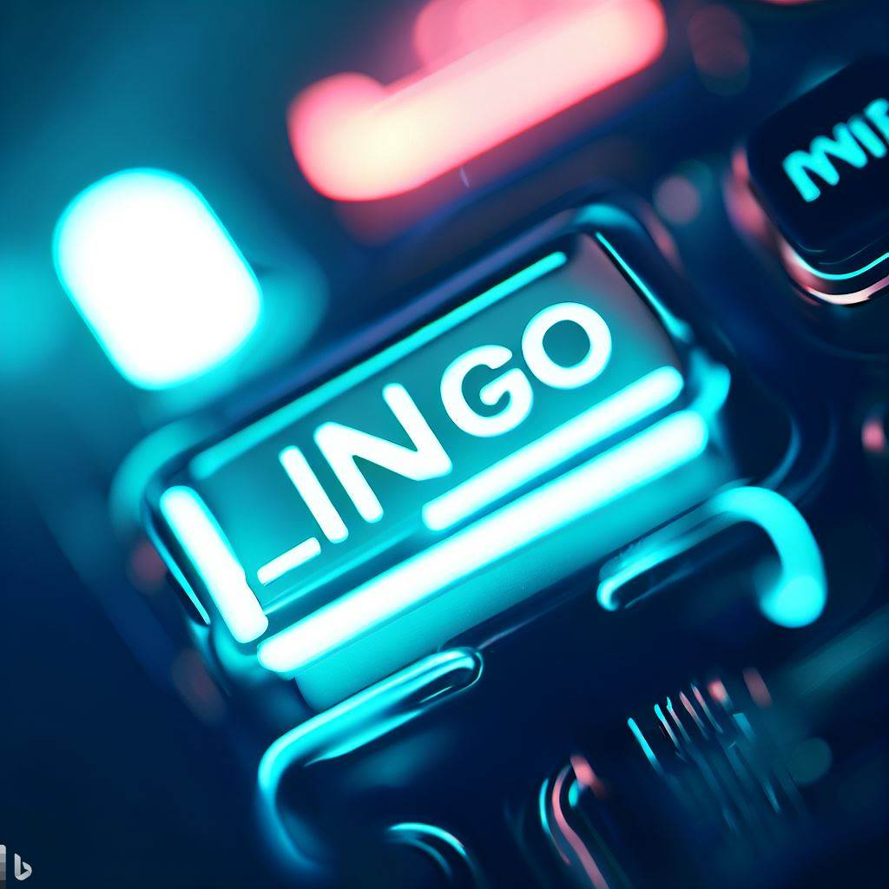

<h2 align="center">LingoSwitch is a web application with international and localization support</h2>

<p align="center">
  <a target="blank"></a>
</p>

## Requirements:

✅ Configure your Node.js/Express application to support localization.

✅ Identify the necessary language files or translation resources to store localized content.

**Localization of Backend (Node.js/Express):**

✅Configure your Node.js/Express application to support localization.

✅Identify the necessary language files or translation resources to store localized content.

Implement middleware or a custom function to handle language detection and selection based on user  
preferences.

Implement server-side localization of messages, error messages, date and time formats, and other application-specific texts.

**Localization of Frontend (Angular):**

✅ Provide required REST endpoint for frontend to be able to match user’s language preference.

**Language Storage in MongoDB:**

Extend the existing MongoDB data model to support language-specific content.

Implement retrieval and storage mechanisms to fetch and update data based on the user's selected language.

**User Language Preferences:**
{
To store individual language preferences, add a language field to your user schema in MongoDB. When a user updates their language preference, update this field accordingly

To persist the language preference across user sessions, store the user's language in a JWT (JSON Web Token) or a session cookie.
}

Implement a user profile or settings functionality to store and retrieve individual language preferences.

✅Ensure the language preference is persisted across user sessions.

✅ Allow users to update their language preferences in the application's settings.

## Installation and Running the app

```bash
# clone the project
$ git clone https://github.com/mehdiqor/LingoSwitch.git

# docker compose
$ docker-compose up -d

# install packages
$ npm install

# run
$ npm start
```

## Stay in touch

- Author - [Mehdi Ghorbani](https://github.com/mehdiqor)
- Telegram - [Mehdi_qor](t.me/Mehdi_qor)
- Email - [mehdighorbanin@gmail.com](mailto:mehdighorbanin@gmail.com)
